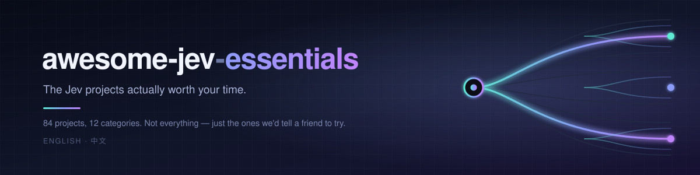

  

# awesome-jev-essentials

**The Jev projects actually worth your time** — picked, compared, kept current.

**English** · [中文](README.zh-CN.md)

## What this is

An **independent, unaffiliated** catalog of Jev projects —
**84 projects across 11 categories**. Not endorsed by,
and not connected to, TypeSafe AI.

Searching for "Jev" returns tens of thousands of repositories, and most of them
are empty, renamed, or a copy of the official docs. **This list does not answer
"what is Jev"** — that is the job of the
[official documentation](https://docs.typesafe.ai), and it changes.
It answers the other question: **of all these projects, which one should I look
at, and why that one.**

**What makes this one worth trusting:** every entry carries a hand-written
reason. There is no entry here that we could not say something specific about —
⭐⭐ **that is the editorial bar, and it is why the list is 84 and not the 10,000+
that a search returns.**

Not by stars. By <strong>what you are trying to do</strong>.

| If you want to… | Start with |
|:--|:--|
| **If you want to understand Jev** | `browser-use/jev-ultrafast` — the biggest cost cut in the ecosystem; read how the single decision is made. |
| **If you want to use it tomorrow** | `tamaratran/fast-jev-compaction` for Claude Code, `Ying-Kai-Liao/jev-browser` for browser work. |
| **If you want to run it yourself** | `Mapika/decider` — open weights, and a 「limits, stated plainly」 section. |
| **If you want to build on it** | start from `kerpopule/hermes-jev-skills`; the loop is already wired. |

---

## Contents

| | Category | Count |
|:--|:--------------------------|--:|
| 🚦 | <a href="#route">Route & classify</a> | 9 |
| 🛡 | <a href="#guard">Guard & verify</a> | 7 |
| 🗜 | <a href="#compact">Compaction & context</a> | 5 |
| 🧩 | <a href="#skills">Skills & agents</a> | 7 |
| 🔎 | <a href="#code">Code search & review</a> | 5 |
| 🌐 | <a href="#browser">Browser & computer use</a> | 4 |
| 🖥 | <a href="#apps">Apps & interfaces</a> | 9 |
| 🔌 | <a href="#infra">Infra, SDKs & bridges</a> | 12 |
| 🔬 | <a href="#open">Open reproductions & alternatives</a> | 10 |
| 📐 | <a href="#eval">Benchmarks & evaluation</a> | 5 |
| 🎯 | <a href="#domain">Domain apps</a> | 11 |
| 📈 | <a href="#hot">Most starred</a> | — |
| 🧭 | <a href="#choose">How to choose</a> | — |

---

<h2 id="route">🚦 Route & classify 9</h2>

<em>Deciding what a request is, before deciding what to do with it.</em>

| Project | Stars · Updated |
|:--------------------------------------------------------|--------------------:|
| **[gargpratyush/jev-router](https://github.com/gargpratyush/jev-router)** created 2026-09-16 · Routes per turn in Claude Code and Codex — simple work to the fast tier, hard work to the strong one — without changing either CLI's interface, tools, sessions or auth. The drop-in kind of router. |   |
| **[prismhq/jev-router](https://github.com/prismhq/jev-router)** created 2026-09-17 · A server-side router: clients send one model id and Jev picks which model serves the request. Transport is LiteLLM, so it slots into an existing gateway rather than replacing it. |   |
| **[miniLV/Jev-Auto-Router](https://github.com/miniLV/Jev-Auto-Router)** created 2026-08-01 · Chinese-language, and honest about it: the README says the architecture is settled but the runtime is still a prototype, and tells you not to treat the design as production install instructions. Rare candour. |   |
| **[shimo4228/jev-skill-router](https://github.com/shimo4228/jev-skill-router)** created 2026-09-21 · The authors built it, ran it, and then published the conclusion that as a router it probably won't help a strong model. It ships shadow-first so you can watch its calls before trusting them. |   |
| **[GodsBoy/jev-agent-skill-router](https://github.com/GodsBoy/jev-agent-skill-router)** created 2026-09-16 · Carries a measured number — 68 of 72 synthetic requests routed correctly against a 70.8% lexical baseline — and labels the result exploratory and reused-data. States its limits next to its win. |   |
| **[jekozyra/pi-typesafe-router](https://github.com/jekozyra/pi-typesafe-router)** created 2026-09-18 · One sentence, one job: classify the request, route it to the right model. The README's second line warns you not to run it alongside another automatic router. |   |
| **[adarshmishra07/jcm-router](https://github.com/adarshmishra07/jcm-router)** created 2026-09-17 · A local proxy that picks model and effort per message, routes subagents, and deliberately leaves your cached main chat alone. Your subscription login keeps working. |   |
| **[mejiasd3v/pi-jev-router](https://github.com/mejiasd3v/pi-jev-router)** created 2026-09-17 · Smallest useful version: Jev picks the model once per session and the choice stays fixed. No per-turn churn — which is the right default if you dislike a model changing under you. |   |
| **[ruban-24/switchboard](https://github.com/ruban-24/switchboard)** created 2026-09-20 · Model-agnostic routing driven by your own policy: Jev assesses the task, your rules decide what that assessment means. Separating judgement from policy is the right shape. |   |

<h2 id="guard">🛡 Guard & verify 7</h2>

<em>Catching bad actions — and bad claims — before they land.</em>

| Project | Stars · Updated |
|:--------------------------------------------------------|--------------------:|
| **[leepokai/jev-guard](https://github.com/leepokai/jev-guard)** created 2026-09-17 · Scores every tool call before it runs. Small and single-purpose — the right size for a guardrail. |   |
| **[y0usaf/pi-jev](https://github.com/y0usaf/pi-jev)** created 2026-09-16 · A tool-call gate that people have actually tested. The most cited starting point in this category. |   |
| **[qkal/Canny](https://github.com/qkal/Canny)** created 2026-09-11 · Stops an agent claiming it's done without evidence. Guards against bad **claims**, not bad actions — a failure mode most guardrails ignore. |   |
| **[jesset/pi-verdict](https://github.com/jesset/pi-verdict)** created 2026-08-25 · A ~1k-line permission gate in the style of Claude Code's auto mode. Built-in danger rules and your own allow/deny lists settle the obvious cases at zero latency; only the ambiguous ones cost a model call. |   |
| **[raihankhan-rk/diffjury](https://github.com/raihankhan-rk/diffjury)** created 2026-09-17 · Paste a PR URL and Jev decides whether it is risky. Shipped as a usable page rather than a library, which makes it the easiest one here to actually try. |   |
| **[DanRWilloughby/snifftest](https://github.com/DanRWilloughby/snifftest)** created 2026-09-17 · Prose linter for AI writing tells: zero dependencies, countable rules, plus one judgment model for the calls a rule cannot make. A clean example of mixing deterministic checks with a model. |   |
| **[GhalebDweikat/winnow](https://github.com/GhalebDweikat/winnow)** created 2026-09-16 · A Claude Code hook that splits every big tool result into ~25-line blocks, asks Jev one yes/no per block in a single batched call, and replaces confident-no blocks with a recallable stub — and it publishes the replay numbers that don't flatter it: ECE 0.14 vs 0.31 for a lexical baseline, 86ms median, $0.036 for 300 cases, plus a calibration table where the observed need rate never drops below 0.26 even in Jev's 0.07 bin. It reports ECE next to ROC AUC specifically because a judge that always answers the base rate scores a great ECE and hides nothing. |   |

<h2 id="compact">🗜 Compaction & context 5</h2>

<em>Deciding what to throw away when the window fills up.</em>

| Project | Stars · Updated |
|:--------------------------------------------------------|--------------------:|
| **[tamaratran/fast-jev-compaction](https://github.com/tamaratran/fast-jev-compaction)** created 2026-09-17 · A Claude Code plugin that scores every tool call before compaction. Rides an existing user base instead of building one. |   |
| **[tamaratran/jev-pruner](https://github.com/tamaratran/jev-pruner)** created 2026-09-18 · Trims noisy Bash output after the command runs but before the result reaches the model — so the saving is real context, not a summarised approximation of it. |   |
| **[joelhooks/pi-fast-jev-compaction](https://github.com/joelhooks/pi-fast-jev-compaction)** created 2026-09-18 · Keeps conversation text verbatim while pruning stale tool history, and says so plainly: layer 1 only — it does not summarise, rewrite, or invent memory. |   |
| **[leonaaardob/fast-dev-compaction](https://github.com/leonaaardob/fast-dev-compaction)** created 2026-09-18 · Port of the Claude Code compaction plugin to Codex lifecycle hooks: score every tool call, compact, then re-inject the verbatim history Jev chose to keep. |   |
| **[compozy/yoshi](https://github.com/compozy/yoshi)** created 2026-09-18 · Context-pruning proxy that judges once above a size gate and then applies the validated omissions while keeping the protocol intact. The README claims are measured, not asserted. |   |

<h2 id="skills">🧩 Skills & agents 7</h2>

<em>Pieces you plug into an agent loop, not finished apps.</em>

| Project | Stars · Updated |
|:--------------------------------------------------------|--------------------:|
| **[safzanpirani/pi-jev-skill-picker](https://github.com/safzanpirani/pi-jev-skill-picker)** created 2026-09-20 · Replaces the whole skills catalog in the system prompt with one ranking tool — so installing more skills stops costing you tokens on every turn. |   |
| **[yuyang2230/jev-agent-skill](https://github.com/yuyang2230/jev-agent-skill)** created 2026-09-19 · Offloads the small frequent judgments — classify, screen, score, check — onto Jev's free tier so the main model only does generation. Chinese docs, and it shows the cost arithmetic. |   |
| **[HyunjunJeon/pi-quiet-ask](https://github.com/HyunjunJeon/pi-quiet-ask)** created 2026-09-17 · Jev as the quiet decision layer: the main model keeps writing code, Jev answers the closed questions the harness has to ask, in about 250 ms. |   |
| **[kerpopule/hermes-jev-skills](https://github.com/kerpopule/hermes-jev-skills)** created 2026-09-18 · Routing, memory, compaction and skill selection. The most complete example of Jev inside an agent loop rather than bolted on the side. |   |
| **[dbreunig/building-with-jev-skill](https://github.com/dbreunig/building-with-jev-skill)** created 2026-09-17 · The skill that teaches an agent how to write Jev questions rather than how to call the API: pick the primitive your code branches on, split any question weighing two properties, put every question sharing a state into one request, and remember a noul of 0.5 means "unsure" and not "medium". It pins itself to jev-1.13 and tells you to recheck the jaggedness page when the model moves. |   |
| **[kitze/skillbox](https://github.com/kitze/skillbox)** created 2026-09-17 · A self-hosted, versioned skills library served over MCP, where Jev is used for one narrow job — scoring your active skill catalog against the current task so the right skills surface. Worth reading for the provider plumbing alone: TypeSafe direct, Vercel AI Gateway or OpenRouter's /alpha/decisions endpoint, catalog batched at 32 skills / 24KB under an 8-second deadline, and a failed batch falls back wholesale rather than returning a partial ranking. |   |
| **[altryne/jevify](https://github.com/altryne/jevify)** created 2026-09-17 · A skill with two modes: during ordinary work it pushes the agent to hand bulk semantic judgments (scan a long doc, rank candidates, check many items) to Jev before pulling text into its reasoning context; say "jevify this codebase" and it hunts for repeated LLM judgments and fragile semantic heuristics worth replacing, and writes the actual questions. The README is upfront that it's a community skill, not a TypeSafe product, and that installing it does not intercept tool output automatically. |   |

<h2 id="code">🔎 Code search & review 5</h2>

<em>Finding and judging code by what it means, not what it matches.</em>

| Project | Stars · Updated |
|:--------------------------------------------------------|--------------------:|
| **[uehaj/jev-semgrep](https://github.com/uehaj/jev-semgrep)** created 2026-09-19 · Scores each line against a proposition, not a topic — "customer asking for a refund" rejects a refund-policy line whose cosine sits near 1. Honest: no index, so every query re-reads the whole corpus. |   |
| **[NiazMorshed2007/jev-review](https://github.com/NiazMorshed2007/jev-review)** created 2026-09-17 · MCP server that gives a coding agent 1-10 scores plus confidence on 19 quality axes — deliberately no blended total and no prose rationale, so diagnosing the cause stays the agent's job. |   |
| **[nassim-arifette/jevgrep](https://github.com/nassim-arifette/jevgrep)** created 2026-09-20 · Returns actual source excerpts with paths and line numbers, not a summary; `inspect` shows offline what would leave your machine. Rare candor: two of three provider transports were never tested live. |   |
| **[devagrawal09/jev-review](https://github.com/devagrawal09/jev-review)** created 2026-09-16 · A code reviewer where the orchestration stays in plain TypeScript and Jev only makes bounded calls along a fixed pipeline — Noul risk matrix, then Choice/Score file profiles, evidence selection, mechanism classification, severity, conditional reviewer routing — with thresholds in code, not in a prompt. The author explicitly scopes it as an experiment and says findings are review prompts, not proof of a defect. |   |
| **[can1357/jegrep](https://github.com/can1357/jegrep)** created 2026-09-19 · Natural-language code search with no embeddings, no index and no daemon — it walks the live tree each run and asks Jev for a calibrated yes/no per path, so thresholds actually mean something across batches; output is dirname/file:first-last ranges you can paste into an editor, and a repo-wide search costs $0.01-0.03. Eleven pluggable exploration strategies live in src/strategies/ if the default cascade doesn't suit your tree. |   |

<h2 id="browser">🌐 Browser & computer use 4</h2>

<em>Driving a real screen, with the per-step decision made cheaply.</em>

| Project | Stars · Updated |
|:--------------------------------------------------------|--------------------:|
| **[Ying-Kai-Liao/jev-browser](https://github.com/Ying-Kai-Liao/jev-browser)** created 2026-09-16 · An LLM names the goal for one step; one ~300ms Jev call picks the element, action, value, and done/blocked. 40/42 live-site tasks, no false "done", and ~8k vs ~557k tokens against a Playwright-MCP loop. |   |
| **[wy-coliney/jev-browser-use](https://github.com/wy-coliney/jev-browser-use)** created 2026-09-18 · Jev picks clicks and scrolls from accessibility text inside Codex's existing Computer Use session, so there's no host-model turn per click; Codex still types and verifies. The 5-10x is flagged approximate. |   |
| **[moritzkremb/jev-voice-browser](https://github.com/moritzkremb/jev-voice-browser)** created 2026-09-17 · One Jev call per partial transcript carries ~10 typed questions in parallel — including "is this addressed to me?" and "is it destructive?" — so it acts mid-sentence. Measured 34/34, ~330ms, $0.01 a demo. |   |
| **[jkudish/jev-browser](https://github.com/jkudish/jev-browser)** created 2026-09-17 · Jev picks one action per step and separately scores "goal met" and "stuck"; code owns budgets and stop gates. Wikipedia Coffee→Espresso in ~4s for $0.0016, and it states plainly what redaction can't cover. |   |

<h2 id="apps">🖥 Apps & interfaces 9</h2>

<em>Finished things you can open and use.</em>

| Project | Stars · Updated |
|:--------------------------------------------------------|--------------------:|
| **[browser-use/jev-ultrafast](https://github.com/browser-use/jev-ultrafast)** created 2026-09-16 · A web agent that replaces the per-step LLM call with a typed decision. **Biggest cost cut in the ecosystem** — every step that used to be a full model call is now one Jev call. |   |
| **[jev-chat/jev-chat-jarvis](https://github.com/jev-chat/jev-chat-jarvis)** created 2026-09-21 · A phone-side copilot for WeChat / QQ / X / Feishu. Low enough latency to keep up with a live conversation — that is the whole point of System One here. |   |
| **[jarrodwatts/jev-trader](https://github.com/jarrodwatts/jev-trader)** created 2026-09-16 · One decision per Monad block. Fast enough to sit inside a block, cheap enough to run every time. |   |
| **[Sac-Y/Jev-cu](https://github.com/Sac-Y/Jev-cu)** created 2026-09-18 · Computer use. The closest thing here to a general desktop agent. |   |
| **[yikangy873-gif/jev-desktop](https://github.com/yikangy873-gif/jev-desktop)** created 2026-09-19 · Codex handles the goal, prepares the text and verifies the result; Jev picks the action and its target in one request. A clean split between planning and deciding. |   |
| **[AboveColin/HA-Jev](https://github.com/AboveColin/HA-Jev)** created 2026-09-17 · Turns Jev's answers into Home Assistant sensors, so an automation can read a probability like any other number. A nice reminder that a decision model needs no chat UI. |   |
| **[thruwire/foreman](https://github.com/thruwire/foreman)** created 2026-09-17 · Puts a fast decision model above slower coding agents: feed it a ticket or a bug report and it decides who does what next. |   |
| **[Silbercue/public-browser](https://github.com/Silbercue/public-browser)** created 2026-04-07 · Lets Claude Code and Cursor drive your real logged-in Chrome, and reports the delta it measured: fewer tokens, fewer tool calls, fewer tool definitions. |   |
| **[shiftynick/jev-axi](https://github.com/shiftynick/jev-axi)** created 2026-09-16 · An agent-ergonomic CLI over Jev: pick, rate, check, rank, triage, guard — the six shapes a typed decision actually takes, exposed as shell commands. |   |

<h2 id="infra">🔌 Infra, SDKs & bridges 12</h2>

<em>Getting Jev into the stack you already have.</em>

| Project | Stars · Updated |
|:--------------------------------------------------------|--------------------:|
| **[burnigtm/jev-mcp](https://github.com/burnigtm/jev-mcp)** created 2026-09-17 · A local stdio MCP server exposing Jev as typed judgments, including a step router that selects a prepared call in the same request. |   |
| **[tacticocc/Jevbridge](https://github.com/tacticocc/Jevbridge)** created 2026-09-18 · ACP and MCP adapter putting Jev next to Codex, Claude, Grok and OpenCode. The README opens by explaining why a text-free model makes a poor chatbot — useful framing. |   |
| **[valentynkit/jev-belay](https://github.com/valentynkit/jev-belay)** created 2026-09-18 · A Claude Code Stop hook that blocks an unverified "done": it reads the transcript, and only when files changed with no check passed does it spend one Jev call. Fails open. |   |
| **[gtaras7/typesafe-jev](https://github.com/gtaras7/typesafe-jev)** created 2026-09-17 · Experiments in building software around a decision model instead of a chat prompt. Each piece is self-contained with its own README, tests and measured results. |   |
| **[legacybridge-tech/pi-typesafe-jev](https://github.com/legacybridge-tech/pi-typesafe-jev)** created 2026-09-17 · Exposes the judgments as five tools, so the model makes narrow semantic calls while your code keeps control of thresholds and weights. |   |
| **[GiesN/typesafe-jev-workflow](https://github.com/GiesN/typesafe-jev-workflow)** created 2026-09-16 · Deliberately small and complete: a mocked email goes in, a typed Choice comes out, and it routes to a demo handler. The clearest minimal wiring in the list. |   |
| **[TypeSafeAI/typesafe-playground](https://github.com/TypeSafeAI/typesafe-playground)** created 2026-09-16 · 110 use cases you can edit and run in the browser. Zero install — the fastest way to feel the latency difference for yourself. |   |
| **[jkudish/jev-mcp](https://github.com/jkudish/jev-mcp)** created 2026-09-17 · Ten typed MCP tools (verify claims against sources, screen a fetched page for injected instructions before it enters context, rerank with no embeddings) at 150–500ms each, with a documented fail-closed contract — one malformed distribution invalidates that claim, not the batch. |   |
| **[itsmostafa/typesafe-mcp](https://github.com/itsmostafa/typesafe-mcp)** created 2026-09-17 · A single static Go binary with no Node or Python runtime; `evaluate setup mcp` finds and registers itself with Claude Code, Claude Desktop, Codex and pi in one command. Takes up to 100 records per call, and one bad record doesn't take down the rest. |   |
| **[vinilana/jev-gateway](https://github.com/vinilana/jev-gateway)** created 2026-09-18 · A local proxy that pulls just the tool-choice step out of Codex/Claude Code/OpenCode and gives it to Jev; when every argument is an enum or boolean it builds the call itself with no LLM request at all. Fails open to passthrough, and admits the Gemini path has never been run live. |   |
| **[peterfriese/jev-foundation-models](https://github.com/peterfriese/jev-foundation-models)** created 2026-09-21 · A Swift 6 package that makes Jev a drop-in provider behind Apple's LanguageModelSession, so a @Generable struct's Bool/enum/@Guide(.range) fields map straight onto noul/choice/score and come back in 40-150ms with probabilities in response.metadata. It also opens with a blunt warning never to ship the API key in an app binary — route through your own backend. |   |
| **[cline/plugins](https://github.com/cline/plugins)** created 2026-05-31 · Cline's official plugin index, and one of its curated entries is a browser plugin that deliberately runs with no LLM in the loop. Worth watching as an integration surface. |   |

<h2 id="open">🔬 Open reproductions & alternatives 10</h2>

<em>Run the idea yourself — local, open-weight, or Jev-compatible.</em>

| Project | Stars · Updated |
|:--------------------------------------------------------|--------------------:|
| **[Mapika/decider](https://github.com/Mapika/decider)** created 2026-09-16 · An open reproduction of the System One class with actual weights (2B/4B/35B-A3B on Qwen3.5 bases, nothing distilled from Jev), and a "Limits, stated plainly" section that admits the ugly parts: 0.30 top-label ECE on JevBench hard items, rules written into the question simply aren't followed at this size (0.67 for a one-sentence question vs 0.24 for a paragraph of rules), and named regressions it hasn't fixed. |   |
| **[logan-markewich/jeff](https://github.com/logan-markewich/jeff)** created 2026-09-19 · Drop-in self-hosted replacement for the Jev endpoint — point TYPESAFE_BASE_URL at it and the official SDK just works — running a 400M GLiFormer encoder instead of an LLM. The README leads with where it loses: 75.5% vs 90.5% on AG News, 38% vs 74% on JevBench's hard tier, in exchange for ~$2.6 vs ~$15.6 per million requests. |   |
| **[kshetrajna12/reflex](https://github.com/kshetrajna12/reflex)** created 2026-09-17 · The rare repo with a "what is proven not to help" section: four LoRA mixes, a 27B distillation, GEPA prompt optimisation, wording ensembles and a reasoning cascade were all measured and none shipped — what won was a frozen model plus a better readout (lettered yes/no, Evidence/Criterion framing, averaging two option orders), good for 0.685 hard-tier at ~200ms. Also runs entirely in your browser on WebGPU with a 650MB model if you just want to see the mechanism. |   |
| **[featherless-ai/simple-jev](https://github.com/featherless-ai/simple-jev)** created 2026-09-18 · Turns any compatible open-weights HF model into a typed-decision server by reading next-token logits — no classifier head, no training — and there's a public demo API you can curl with no key at all (2k context, 2 RPS). It also says out loud that its choice/score confidences and noul values are not calibrated probabilities of correctness, which most wrappers quietly imply they are. |   |
| **[jaredpalmer/kev](https://github.com/jaredpalmer/kev)** created 2026-09-17 · 0.8B/4B/9B models on Qwen3.5 with training code and frozen eval suites; it reports 95% CIs, test sets read once per checkpoint, and says outright that its Jev comparison isn't controlled. |   |
| **[TianyuCodings/NanoJev](https://github.com/TianyuCodings/NanoJev)** created 2026-09-17 · One 0.6B Qwen3-plus-decision-heads checkpoint plays maze, Snake and two ViZDoom tasks: 128/128 on ViZDoom Basic vs Jev's 56/128 — and it also publishes the maze task where it loses, 4/10 to 7/10. |   |
| **[wfzyx/von](https://github.com/wfzyx/von)** created 2026-09-18 · A 395M ModernBERT encoder running ~18ms locally that out-kills Jev in ViZDoom Defend the Center (9.00 vs 5.62) — but read its own table: 72.0% vs Jev's 96.6% on the 49-task suite, not the 91.23% headline. |   |
| **[razorback16/openjev](https://github.com/razorback16/openjev)** created 2026-09-18 · Uses DiffusionGemma's discrete diffusion sideways: mask only the answer slots on the canvas, one read-only pass, and the distribution is the answer. 27ms p50 per question, with a 4x re-read only when entropy > 0.1. |   |
| **[ekzhang/openjev-sglang](https://github.com/ekzhang/openjev-sglang)** created 2026-09-17 · Qwen3.6-35B on SGLang/B200: N+1 one-token prefills, a throwaway call to warm the radix cache, 64 answer labels verified single-token at boot, and a flat note that the probabilities aren't calibrated. |   |
| **[nokia-applied-research/AnyJev](https://github.com/nokia-applied-research/AnyJev)** created 2026-09-21 · No training: reads the answer off one prefill, then averages over all K cyclic option rotations to cancel position bias (order-flip 0.230 to 0.073, zero labels). Admits its 'gold' teacher self-agrees only 0.735. |   |

<h2 id="eval">📐 Benchmarks & evaluation 5</h2>

<em>How well does it actually hold up — measured, by people who are not selling it.</em>

| Project | Stars · Updated |
|:--------------------------------------------------------|--------------------:|
| **[fstandhartinger/jevbench](https://github.com/fstandhartinger/jevbench)** created 2026-09-19 · Benchmarks 48 Jev-class decision models on a harmonic mean of Intelligence, Calibration, Speed and Cost, with 220 hard items frozen and hashed before any system ran and half held out sealed. Two things make it worth reading even if you skip the leaderboard: Cost is quoted per 1,000 decisions rather than per 1,000 tokens (with the arithmetic shown), and it flags that one entrant scored 72% vs 21% purely from flipping the option order. |   |
| **[Zaious/jev-capability-atlas](https://github.com/Zaious/jev-capability-atlas)** created 2026-09-18 · Deliberately not a leaderboard — it maps where Jev holds up versus where it breaks, backed by real API-call receipts. The standout entry is their own failure: a typo in one option of a history question got picked with 0.90 confidence, and fixing only the typo fixed the answer; a reader caught the mistake in issue #2 and the repo corrected itself. Chinese-first, bilingual. |   |
| **[openlayer-ai/jevals](https://github.com/openlayer-ai/jevals)** created 2026-09-20 · Rebuilds Ragas-style metrics as typed questions in one batched request — 8 evals on a trace for $0.00006 in 0.33s — and its `calibrate` command prints wrong-pass vs missed-pass at each threshold. Unusually blunt Status: adapters were tested against fakes, not run live. |   |
| **[danielgshea/jev-as-a-judge](https://github.com/danielgshea/jev-as-a-judge)** created 2026-09-17 · Froze five agent runs and had each judge re-score them 100 times: Jev matched every human pass/fail label (Claude Sonnet 4.6 hit 80%), with 92–913x less score variance and $0.34 total cost against $28.17. The authors keep saying out loud that it's five cases and one human reviewer. |   |
| **[sutro-sh/jev-align](https://github.com/sutro-sh/jev-align)** created 2026-09-19 · An active-learning loop: it surfaces the rows Jev is least certain about, you label them, GEPA rewrites the function definition — and a higher training score never auto-accepts a proposal, you do. Shared functions carry the labels but not your raw rows. |   |

<h2 id="domain">🎯 Domain apps 11</h2>

<em>Jev pointed at one specific problem.</em>

| Project | Stars · Updated |
|:--------------------------------------------------------|--------------------:|
| **[Hangzhi/diffusion-jev-sglang](https://github.com/Hangzhi/diffusion-jev-sglang)** created 2026-09-21 · A diffusion model that runs Jev-style typed decisions on images — guess the doodle, name the flower, pick an emoji. Whether Jev's shape generalises past text, tested. |   |
| **[shitianfang/jev-use](https://github.com/shitianfang/jev-use)** created 2026-09-19 · Hands the agent steps that need no text output to Jev, with the numbers stated up front: p50 around 230 ms. Chinese docs. |   |
| **[kyotofin/tax-doc-classifier](https://github.com/kyotofin/tax-doc-classifier)** created 2026-09-18 · Replaces a production Sonnet page classifier: $0.00115 vs $0.039 a page, ~0.5s vs 3.3s, 261 IRS forms vs 30. Scoring is strict — under 0.95 confidence counts as an error even when the answer is right. |   |
| **[jerryjliu/docjev](https://github.com/jerryjliu/docjev)** created 2026-09-19 · Classifies and splits multi-document PDF packets from locally extracted text. Its 40-document benchmark honestly reports the loss: Jev ties on classification (40/40) but splits 7/8 packets against Luna's 8/8. |   |
| **[realZachi/pg-jev](https://github.com/realZachi/pg-jev)** created 2026-09-17 · A Postgres extension that makes `WHERE jev(tickets,'the customer is angry')` an ordinary boolean function. The batching writeup is the payoff: 20 rows/request is 100% correct, 40 drops to 92–98%, 80 to 77–94%. |   |
| **[fazlerocks/jevmail](https://github.com/fazlerocks/jevmail)** created 2026-09-19 · Gmail triage that asks Jev three questions per message (which tray, 1–5 urgency, human-written?) — 1,000 emails in about a minute for ~3 cents. It requests only gmail.readonly, so it cannot archive or send. |   |
| **[rmalde/minecraft-agent](https://github.com/rmalde/minecraft-agent)** created 2026-09-20 · GPT-6 Astra plans and Jev picks each next action from structured game state rather than screenshots: 131 Jev decisions plus 35 planner calls to kill the Ender dragon in 8m43s from an empty inventory. |   |
| **[fhshaik/typesafe-mario](https://github.com/fhshaik/typesafe-mario)** created 2026-09-16 · Plays Super Mario Bros. with no screenshots at all: it parses emulator RAM into object-centric JSON (jump trajectory, enemy contact timing, takeoff deadline, measured observation-to-action delay) and Jev picks one of seven controller macros every eight frames. Notably, there is no scripted recovery override — code computes the timing facts, Jev still owns the button. |   |
| **[RomanSlack/jev-drone](https://github.com/RomanSlack/jev-drone)** created 2026-09-16 · A MuJoCo quadrotor where Jev runs at ~2.5 Hz as pure tactical advice — a 50 Hz reflex layer keeps veto power and refuses a 'climb' unless the measured obstacle top edge is inside the climb ceiling. The honesty is the real draw: it reports the win (77.5 m full course vs 17.7 m baseline, 0.11 s median latency, 80 calls) and then says the Jev column is a single run, and that an earlier matched 3-seed test showed no advantage at all. |   |
| **[bytelabs-oss/clash-jev](https://github.com/bytelabs-oss/clash-jev)** created 2026-09-21 · Plays Clash Royale on a real Android phone over adb with zero trained policy — OpenCV plus a hand-labelled troop classifier builds a JSON state once a second, then Jev answers three chained questions (strategy, card, square) in ~135 ms each, about $0.004 a match. The design table is the best part: they deliberately refuse to filter unaffordable cards or inject counter lists, because when the state listed counters the right card jumped from a coin-flip to 98% — that number measured the author, not the model. |   |
| **[trungdq88/youtube-sponsor-detection](https://github.com/trungdq88/youtube-sponsor-detection)** created 2026-09-17 · Skips YouTube sponsor reads with Jev never touching a timestamp: the transcript is rendered as `L042\|` lines, Jev picks line IDs in 80-line windows, and code maps them back to seconds. Three modes with published cost per hour watched (under a cent for transcript-only, $0.46 for pure listen-by-ear), a deliberate bias toward watching an extra second rather than cutting content, and an eval harness scored against SponsorBlock labels for recall, precision and boundary error. |   |

<h2 id="hot">📈 Most starred (raw data, auto-sorted)</h2>

<em>Star count says how many people bookmarked something, **not whether it works**. This ordering is nothing but that number. To pick one, use the table above.</em>

| # | Project | Stars | Created |
|--:|:--------------------------|--------------------:|------------------:|
| 1 | **[browser-use/jev-ultrafast](https://github.com/browser-use/jev-ultrafast)** |  |  |
| 2 | **[tamaratran/fast-jev-compaction](https://github.com/tamaratran/fast-jev-compaction)** |  |  |
| 3 | **[jaredpalmer/kev](https://github.com/jaredpalmer/kev)** |  |  |
| 4 | **[jev-chat/jev-chat-jarvis](https://github.com/jev-chat/jev-chat-jarvis)** |  |  |
| 5 | **[jarrodwatts/jev-trader](https://github.com/jarrodwatts/jev-trader)** |  |  |
| 6 | **[TianyuCodings/NanoJev](https://github.com/TianyuCodings/NanoJev)** |  |  |
| 7 | **[kerpopule/hermes-jev-skills](https://github.com/kerpopule/hermes-jev-skills)** |  |  |
| 8 | **[Sac-Y/Jev-cu](https://github.com/Sac-Y/Jev-cu)** |  |  |
| 9 | **[devagrawal09/jev-review](https://github.com/devagrawal09/jev-review)** |  |  |
| 10 | **[wfzyx/von](https://github.com/wfzyx/von)** |  |  |

---

---

### About

An **independent, unaffiliated** catalog of Jev projects —
**84 projects across 11 categories**. Not endorsed by,
and not connected to, TypeSafe AI.

Searching for "Jev" returns tens of thousands of repositories, and most of them
are empty, renamed, or a copy of the official docs. **This list does not answer
"what is Jev"** — that is the job of the
[official documentation](https://docs.typesafe.ai), and it changes.
It answers the other question: **of all these projects, which one should I look
at, and why that one.**

**What makes this one worth trusting:** every entry carries a hand-written
reason. There is no entry here that we could not say something specific about —
⭐⭐ **that is the editorial bar, and it is why the list is 84 and not the 10,000+
that a search returns.**

### What updates

**This list is maintained, not published once.** Here is what changes:

- 🔄 **Stars and last-commit dates are live.** Every count on this page is a
  badge, not a typed number, so it is never out of date.
- 📈 **The ranking table is re-sorted every day.** New projects climb, stale
  ones fall, on their own.
- 🔍 **Dead links get removed.** Deleted and renamed repos are caught
  automatically — ⚠️ without that, a dead entry just sits there looking fine.
- ✍️ **New entries have to earn their place.** See
  [CONTRIBUTING.md](CONTRIBUTING.md). The short version: **if we cannot say why
  a project is on this list, it does not go on.**